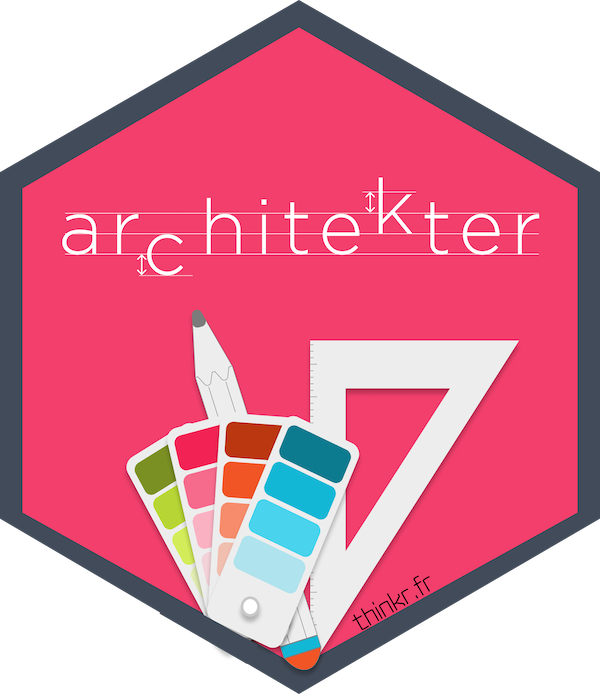
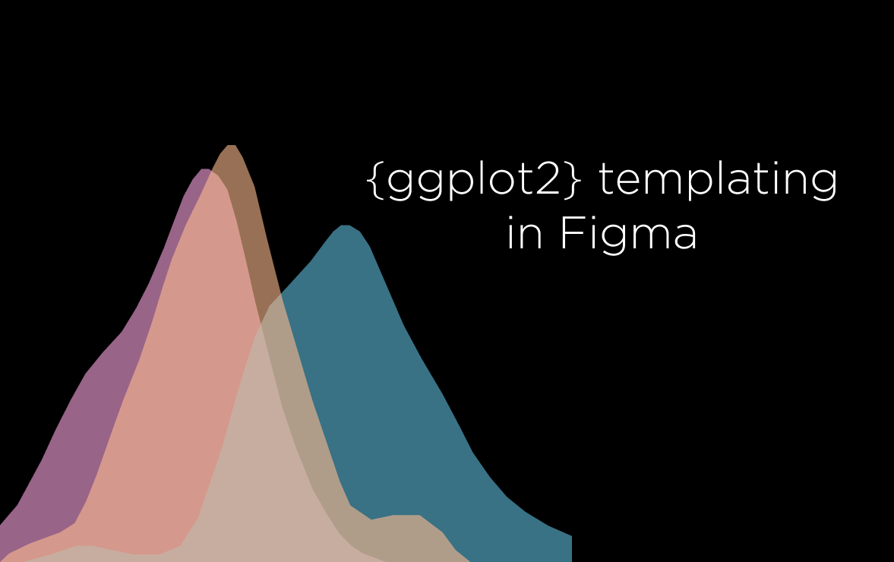
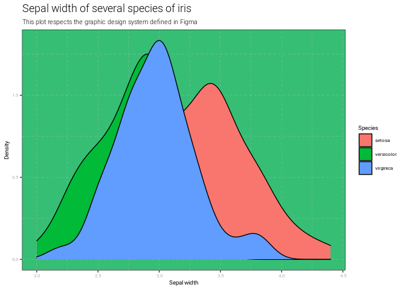

<!-- README.md is generated from README.Rmd. Please edit that file -->

# architekter 

<!-- badges: start -->

[](https://github.com/ThinkR-open/architekter/actions)
[](https://lifecycle.r-lib.org/articles/stages.html#experimental)
<!-- badges: end -->

### Hey, what is that?

Well…

Imagine that…

You are about to have your house built. Where do you start? By creating
the plans, right?

Well, it’s the same with a `{ggplot2}` graph. Start by building the
plans of your data visualization: its organization, its colours, etc. In
a familiar click-button environment (you will seen, Figma will do the
job very well).

Like an architect who guides you in extracting the ideas you have in
mind for the structure of your house and in transforming them into
technical concepts, `{architekter}` will build for you the basis of your
`theme()` function, by extracting the `{ggplot2}` elements from your
Figma model. You can then modify your `theme()` function directly in R.
But `{architekter}` greatly prefers this work, especially if you are not
yet very familiar with the construction of `{ggplot2}` themes.

> “architekter” means “architect” in Breton, a regional language spoken
> in France. And that Brittany is one of the most beautiful places in
> the world.

### What is Figma?

Figma is a the collaborative interface design tool.

Figma is free.

More information here: <https://www.figma.com/design/>


### How can I install it?

You can install the development version of {architekter} from
[GitHub](https://github.com/) with:

``` r
# install.packages("devtools")
devtools::install_github("ThinkR-open/architekter")
```

### How should I use it?

-   Create a Figma account (<https://www.figma.com>)

-   Duplicate the following Figma file:
    <https://www.figma.com/community/file/1089210046480653802> *You we
    get a copy on your Figma account, and you will be able to modify
    your version to create your own {ggplot2} maquettes in Figma*



-   Create a personal access token on your Figma account
    (<https://www.figma.com/developers/api> Section Access tokens)

-   Create an environment variable with your Figma Token:

``` r
Sys.setenv(FIGMA_TOKEN = "your-token-here")
```

-   Restart your R session

-   Load `{architekter}`:

``` r
library(architekter)
```

-   Extract the {ggplot2} theme from your Figma file:

``` r
my_awesome_theme <- get_figma_file_content(
  file_key = "wRqIvMmymzSPuj0sEhnORb",
  acess_token = Sys.getenv("FIGMA_TOKEN")
  ) %>%
  create_theme_fun()
```

-   Use the {ggplot2} theme:

``` r
library(ggplot2)

ggplot(data = iris) + 
  aes(x = Sepal.Width, fill = Species) + 
  geom_density() + 
  labs(title = "Sepal width of several species of iris",
       subtitle = "This plot respects the graphic design system defined in Figma",
       x = "Sepal width",
       y = "Density", 
       color = "Iris species") +
  my_awesome_theme()
```


